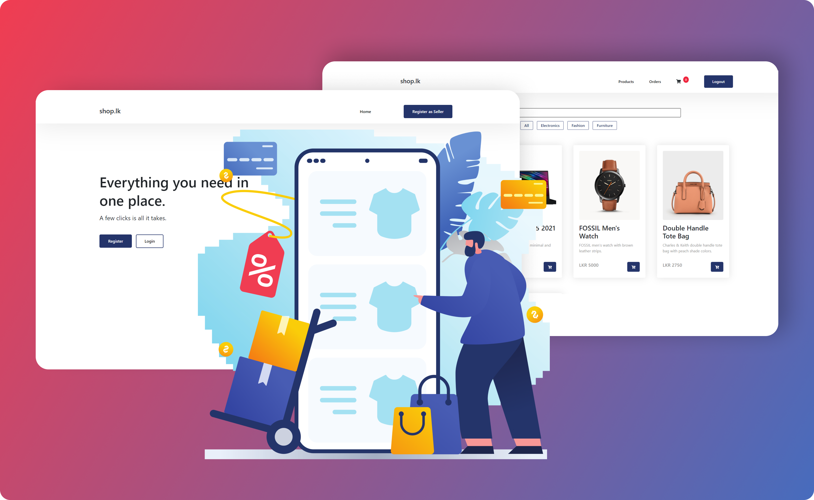

# Shop.lk

We have built an e-commerce system where users need to log in to the system to
access the services. If the user is a new customer, he or she needs to register to the
system before login in. There are two types of users: buyers and sellers. Two separate
logins are available for the users. If the user login as a buyer, he or she can see the grid
view of product items. Buyers can buy products that are introduced to the system by
sellers. Buyers can select preferred product items and add them to the cart. In the cart,
users can add or remove product items or proceed to the checkout. In the checkout, the
user needs to enter the payment details to continue the payment. After completing the
payment, user will receive an email with the order details. Buyers can view the order list
with their details on the orders page. If the user logged in as a seller, he or she can add
new product items to the system, and it will direct to the product list page which gives the
list of product items. On the product list page, the user can edit or delete a product from
the system. We have used React to implement the frontend and Spring boot for the
backend REST API. We used mongo db for the database and WSO2 enterprise integrator
as the middleware.

#### NOTE❗: This project is developed just for assignment purposes.
